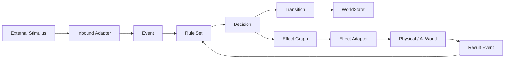
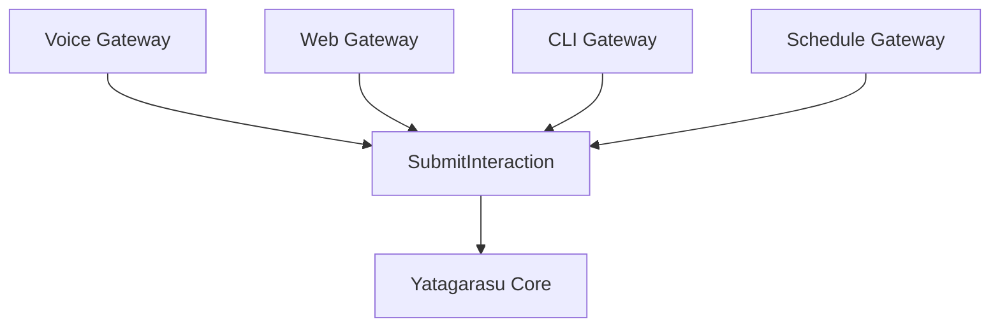

# Yatagarasu 2 Architecture Vision

## 1. この文書の位置づけ

Yatagarasu 1は、安価な見守りカメラを、声を聞き、首を動かし、世界を見て、会話を覚える
実用ロボットへ変えた。専用ウェイクワード、STT、SBERT Skill Router、カメラ制御、画像認識、
LLM、記憶、TTSが、実機上で価値を生むことも確認できた。

一方、その価値は段階的な実験によって獲得されたため、処理の時間軸と責任が
`listend.py`、`bin/yatagarasu`、Skill、外部サービスへ分散している。

Yatagarasu 2は、この成果を捨てる全面リライトではない。

Yatagarasu 1で発見した本当のドメインを、状態、規則、遷移、Effectとして再記述する
「概念上の再構築」である。

## 2. 設計の出発点

Yatagarasu 2では、最初にコンポーネント一覧を作らない。
最初に次の問いへ答える。

1. Yatagarasuにとって「現在の世界」とは何か。
2. 世界では、どのような事実が起きるのか。
3. ある事実と世界の組み合わせに、どの規則が適用できるのか。
4. 規則は、どのような未来の状態遷移を生成するのか。
5. 現実世界へ働きかける必要がある場合、どのEffectを要求するのか。
6. Effectの完了または失敗を、どのような新しい事実として世界へ戻すのか。

実装技術、プロセス数、HTTP、Unix socket、Python、Rustは、この問いへ答えた後に決める。

## 3. 美しさの基準

### 3.1 構造が仕様を説明する

コードの実行順を追わなくても、型とその関係からシステムの意味を理解できること。

### 3.2 状態の所有者が一人である

同じ状態を複数のオーケストレーターが変更しない。

ただし、システム全体を一つの巨大な司令塔へ集約するという意味ではない。
互いに重ならない状態を所有する複数の小さな状態機械は共存できる。

### 3.3 Ruleは外界を変更しない

Ruleはカメラを動かさず、音声を再生せず、HTTPを呼ばない。
Ruleは、可能なTransitionと要求すべきEffectを生成する。

### 3.4 Effectは命令ではなく値である

`move_camera()`をその場で呼ぶ代わりに、`MoveCamera`という値を生成する。
Effectは記録、比較、再試行、拒否、可視化が可能でなければならない。

### 3.5 Engineは賢くしない

EngineはEventを受け、適用可能なRuleを評価し、Transitionを適用し、Effectを配送する。
カメラや会話の個別判断をEngineへ書かない。

### 3.6 副作用を周縁へ押し出す

Coreは可能な限り純粋に保つ。
時刻、乱数、ファイル、ネットワーク、GPU、マイク、カメラ、LLMはPortの外側に置く。

### 3.7 拡張は追加で表現する

新しい入力、新しいIntent、新しいカメラ、新しいLLM、新しい表示先の追加によって、
既存のCoreやMainの条件分岐を増やさない。

### 3.8 実用性を犠牲にしない

抽象化は美しさの演出ではない。
低遅延、誤動作防止、障害復旧、実機のかわいらしい動き、導入しやすさに寄与しない
抽象化は採用しない。

## 4. Yatagarasu 2の世界観



中心にあるのはサービス間呼び出しではない。

```text
WorldState + Event
    -> Rule
    -> Decision(Transition, Effects)
    -> WorldState'
```

外界の処理結果は、新しいEventとして同じ循環へ戻る。

## 5. 一人のオーケストレーターではなく、一つの法則

Yatagarasu 1では「誰がオーケストレーターか」が問題になりやすい。
Yatagarasu 2では、オーケストレーションを巨大なクラスの責務にしない。

システムを統一するものは、司令塔ではなく、次の共通法則である。

```text
事実を受け取る
適用可能な規則を求める
状態遷移とEffectを生成する
状態を進める
Effect結果を新しい事実として受け取る
```

Voice Session、Command Execution、Device Residencyなどは、それぞれ独立した状態を持てる。
各状態機械はEventで接続され、他者の状態を直接変更しない。

## 6. Bounded Context

初期構想では、次の境界を置く。

### 6.1 Acoustic Context

マイク入力、VAD、ウェイク検出、録音区間、STT、自己音声抑制を扱う。

出力は「文字列」ではなく、出所と時刻を持つ`UtteranceRecognized` Eventである。

### 6.2 Interaction Context

ユーザーからの入力を一つのInteractionとして受理し、完了、失敗、取消までの状態を持つ。

### 6.3 Intent Context

発話を意味Intentへ変換する。
SBERTによる高速Route、明示ルール、LLMへの委譲はStrategyとして交換可能にする。

### 6.4 Planning Context

Intent群を、依存関係付きEffect Graphへコンパイルする。

「右を向いて何が見える？」は、処理手順のif文ではなく、次の構造になる。

```text
MoveRight -> WaitForMotionSettled -> CaptureImage -> AskAgent -> Speak
```

### 6.5 Execution Context

Effect Graphから実行可能になったEffectを選び、資源制約を守って配送する。
Effect自身の実装は知らない。

### 6.6 Conversation Context

会話Turn、直近文脈、連想記憶、生成回答、記憶保存を扱う。
SemanticMemoryはこのContextの外部Adapterであり、ドメインそのものではない。

### 6.7 Device Context

カメラ姿勢、移動中、利用可能性、撮影、音声出力など、物理デバイスの観測可能な状態を扱う。

### 6.8 Projection Context

Eventから、Web GUI、CLI、ログ、メトリクス向けの読み取りモデルを構築する。
表示側はCoreの内部状態を直接読まない。

## 7. 入力は同格、意味は一つ

音声、Web、CLI、定時実行、外部センサーは、すべてInbound Adapterである。



音声だけが特別なのは、文字列へ変換されるまでである。
意味処理へ入った後は、Web入力と音声入力を別ロジックへ流さない。

## 8. プロセス境界はアーキテクチャではない

Yatagarasu 2の論理境界は、Python module、別process、Docker、別machineのどれでも表現できる。

初期実装では一つの`yatagarasud` processに複数Contextを同居させてもよい。
障害分離や配置要求が生じたら、Event契約を保ったままprocessを分割できる。

> Process boundary is a deployment decision. Domain boundary is a design decision.

この二つを混同しない。

## 9. Yatagarasu 1との関係

Yatagarasu 1は失敗した設計ではない。
ドメインを発見するための実験機として成功している。

Yatagarasu 2は次を引き継ぐ。

- 実機で検証されたウェイクワードと音声処理
- SBERTによる高速な反射Intent
- PTZ接続常駐化
- go2rtc HTTP frame API
- Codex CLI / Hoshikage連携
- 直近記憶と連想記憶
- VOICEVOXとTapo音声出力
- `.env`で得られた運用知識
- `doctor`で得られた診断観点

引き継がないのは、これらを結び付けている手続きの形である。

## 10. 設計上の標語

> ロボットを動かすコードを書かない。
> ロボットの世界が、どの事実によって、どう変化しうるかを記述する。
