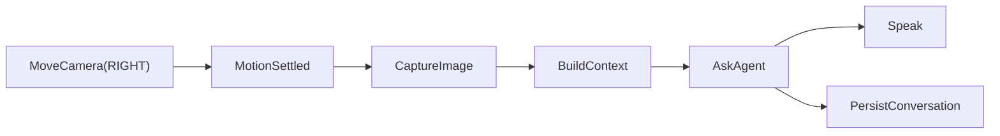
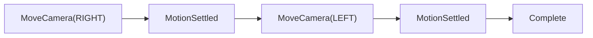
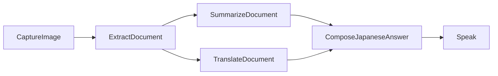
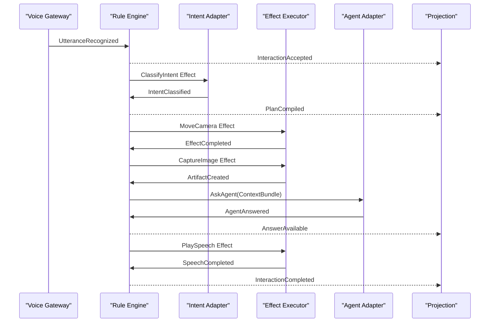

# Domain and Execution Model

## 1. Kernel Algebra

Yatagarasu 2のCoreは、概念的には次の型で表現する。

```python
Rule = Callable[[WorldView, Event], Iterable[Decision]]
Transition = Callable[[WorldState], WorldState]

@dataclass(frozen=True)
class Decision:
    transition: Transition
    effects: tuple[Effect, ...]
```

Engineはこの代数を接続するだけである。

```python
def evolve(
    state: WorldState,
    event: Event,
    rules: Iterable[Rule],
) -> Evolution:
    decisions = (
        decision
        for rule in rules
        for decision in rule(WorldView(state), event)
    )
    decision = select(decisions)
    return Evolution(
        state=decision.transition(state),
        effects=decision.effects,
    )
```

これは実装コードの確定案ではない。
重要なのは、判断、状態変化、副作用の要求を別の値として扱うことである。

## 2. WorldState

`WorldState`は「システム内の全データを詰め込んだ巨大オブジェクト」ではない。
現在の判断に必要な、正規化された世界のスナップショットである。

```python
@dataclass(frozen=True)
class WorldState:
    acoustic: AcousticState
    interactions: InteractionBook
    devices: DeviceState
    capabilities: CapabilityState
    resources: ResourceState
```

大きな画像、音声、モデル、会話全文はStateへ埋め込まない。
それらは`ArtifactRef`、`MemoryRef`、`ModelRef`として参照する。

### 2.1 AcousticState

```text
Dormant
ListeningForWake
Acknowledging
CapturingUtterance
Transcribing
SuppressedBySystemAudio
Recovering
```

ウェイク検出と命令実行の状態を混ぜない。
音響上の状態はAcoustic Contextだけが所有する。

### 2.2 InteractionState

```text
Received
Routing
Planned
Executing
WaitingForAgent
Responding
Completed
Failed
Cancelled
```

各Interactionは`InteractionId`を持つ。
音声、Web、CLIのどこから来ても同じ状態機械を通る。

### 2.3 DeviceState

デバイス状態は「最後に命令した値」と「観測できた値」を区別する。

```python
@dataclass(frozen=True)
class CameraState:
    requested_pose: CameraPose | None
    observed_pose: CameraPose | None
    motion: MotionState
    availability: Availability
```

安価なカメラでは動作完了通知が取れない場合がある。
その場合は`observed_pose=None`のまま、settle timerによる
`MotionAssumedSettled` Eventを生成する。

不確実な現実を、確実な状態として偽装しない。

## 3. CommandとEvent

Commandは「してほしいこと」、Eventは「起きた事実」である。

```text
Command: SubmitText("右を向いて")
Event:   InteractionSubmitted(...)

Command: CancelInteraction(id)
Event:   InteractionCancelled(id)

Effect:  MoveCamera(RIGHT)
Event:   CameraMoveCompleted(effect_id)
```

Commandは拒否される可能性がある。
Eventはすでに起きた事実なので、過去形で命名し、取り消さない。

主要Eventの例:

- `WakeWordDetected`
- `WakeAcknowledgementPlayed`
- `UtteranceCaptured`
- `UtteranceRecognized`
- `TextSubmitted`
- `InteractionAccepted`
- `IntentClassified`
- `PlanCompiled`
- `EffectStarted`
- `EffectCompleted`
- `EffectFailed`
- `AgentAnswered`
- `SpeechCompleted`
- `InteractionCompleted`
- `InteractionFailed`
- `TimeoutElapsed`
- `CapabilityBecameUnavailable`

## 4. Rule

Ruleは次の性質を持つ。

- 外界へアクセスしない
- 入力Stateを変更しない
- 適用不能なら何も生成しない
- 適用可能ならDecisionを生成する
- Ruleの優先度はRule自身ではなくPolicyが決める

例:

```python
def accept_text_rule(
    world: WorldView,
    event: Event,
) -> Iterator[Decision]:
    match event:
        case TextSubmitted(interaction_id, source, text):
            if world.can_accept(interaction_id):
                yield Decision(
                    transition=accept_interaction(
                        interaction_id,
                        source,
                        text,
                    ),
                    effects=(
                        ClassifyIntent(interaction_id, text),
                    ),
                )
```

ifやmatchの存在自体を悪としない。
局所的なRule内部で、型を絞り込むための分岐は自然である。

排除すべきなのは、Mainや巨大Serviceに、互いに異なる業務判断が時系列で積み重なることである。

## 5. Transition

Transitionは状態変換を値として表す。

```text
WorldState -> WorldState
```

Transitionは次を満たす。

- 純粋である
- 元のStateを変更しない
- 同じStateへ適用すれば同じ結果になる
- 外部I/Oを行わない
- 単体テスト可能である

Transitionの例:

- `accept_interaction`
- `attach_intent_result`
- `install_execution_plan`
- `mark_effect_running`
- `complete_effect`
- `fail_effect`
- `complete_interaction`

## 6. Effect

Effectは、Coreが外界へ依頼する仕事を表す不変値である。

```python
Effect = (
    MoveCamera
    | CaptureImage
    | RecallMemory
    | AskAgent
    | SynthesizeSpeech
    | PlaySpeech
    | PersistConversation
    | StartTimer
)
```

各Effectは最低限、次を持つ。

```python
@dataclass(frozen=True)
class EffectMeta:
    effect_id: EffectId
    interaction_id: InteractionId
    idempotency_key: str
    deadline: Instant | None
    retry_policy: RetryPolicy
    resource_claims: tuple[ResourceClaim, ...]
```

Effect AdapterはStateを変更しない。
処理結果を`EffectCompleted`または`EffectFailed` Eventとして返す。

## 7. Effect Graph

複合Intentの実行順序は、if文や固定手順ではなく、依存関係付きのグラフとして表す。

### 7.1 右を向いて


LLMも発話も不要である。

### 7.2 右を向いて何が見える



### 7.3 右を向いて左を向いて



「複数方向を許可する」という個別分岐ではなく、同じResourceを要求するEffectが
依存関係によって直列化される。

### 7.4 この書類を要約して和訳して



要約と翻訳を一つの巨大Promptへ埋めるか、独立Taskとして並列化するかはPlanner Strategyで選べる。
Engineは文書処理の意味を知らない。

## 8. Planner

PlannerはIntentの集合からEffect Graphを生成する。

```python
Planner = Callable[[PlanningContext, IntentSet], ExecutionPlan]
```

初期Strategy:

- `ReflexPlanner`
  - High confidenceのmove、view、recallを決定論的に構築する
- `AgentPlanner`
  - 未知のIntentやMiddle confidenceをAgentへ委譲する
- `CompositePlanner`
  - 複数PlannerのPlan fragmentを合成する

PlannerはEffectを実行しない。
「どの仕事が存在し、何に依存するか」を宣言するだけである。

## 9. Scheduler

SchedulerはPlanの意味を知らない。
完了済み依存とResource制約から、開始可能なEffectを列挙する。

```python
ReadyEffectSelector = Callable[
    [ExecutionPlan, ResourceState],
    Iterable[Effect],
]
```

Resource例:

- `camera.ptz`
- `camera.snapshot`
- `camera.speaker`
- `agent.local_gpu`
- `memory.semantic`

同じResourceを排他的に要求するEffectは同時実行しない。
独立したRecallとCamera Moveは、安全であれば並列実行できる。

順番は手続きへ埋め込まず、依存関係とResource Claimから導出する。

## 10. Artifact

画像や音声を、Promptへ直接埋め込んだ絶対パスとして扱わない。

```python
@dataclass(frozen=True)
class ArtifactRef:
    artifact_id: ArtifactId
    media_type: str
    location: ArtifactLocation
    created_at: Instant
    provenance: Provenance
```

Agent Adapterが`ArtifactRef`を、Codex CLIなら絶対パス、HTTP APIならmultipartやURLへ変換する。
CoreはAgent固有の受け渡し方法を知らない。

## 11. ContextBundle

Agentへ渡す文脈も型として構造化する。

```python
@dataclass(frozen=True)
class ContextBundle:
    user_request: UserRequest
    recent_turns: tuple[ConversationTurn, ...]
    recalled_memories: tuple[MemoryFragment, ...]
    observations: tuple[Observation, ...]
    instructions: tuple[Instruction, ...]
```

PromptはCoreの真実ではない。
Agent Adapterが`ContextBundle`から対象モデル向けPromptをレンダリングする。

これにより、Codex CLI、Hoshikage、Claude Code、将来のAPIで、ドメイン処理を共有できる。

## 12. Conversation

会話保存はAgent呼び出しの末尾に置かれたshell処理ではなく、Plan上のEffectになる。

記憶の構造:

- `ConversationTurn`
- `RecentContext`
- `SemanticRecall`
- `LongTermMemory`
- `MemoryWriteReceipt`

直近3件と連想3件は、Adapter内部の暗黙動作ではなく`RecallPolicy`という値で表す。

```python
RecallPolicy(
    recent_limit=3,
    semantic_limit=3,
    semantic_threshold=0.7,
)
```

## 13. Projection

Web GUIはログを解析しない。
Eventから構築されたProjectionを読む。

### ConversationProjection

- ユーザー入力
- Yatagarasu回答
- 入力元
- 画像
- 開始時刻、完了時刻

### RuntimeProjection

- Standby / Listening / Thinking / Acting / Speaking
- 実行中Effect
- Queue
- 利用可能Capability

### DiagnosticProjection

- Effect別レイテンシ
- Router score
- Agent応答時間
- エラーと再試行
- モデルResident状態

Projectionは表示要求に合わせて作り直せる。
Core StateへUI都合のフィールドを追加しない。

## 14. 一つのInteractionの完全な流れ



すべての矢印は、型を持つCommand、Event、Effectのいずれかである。
