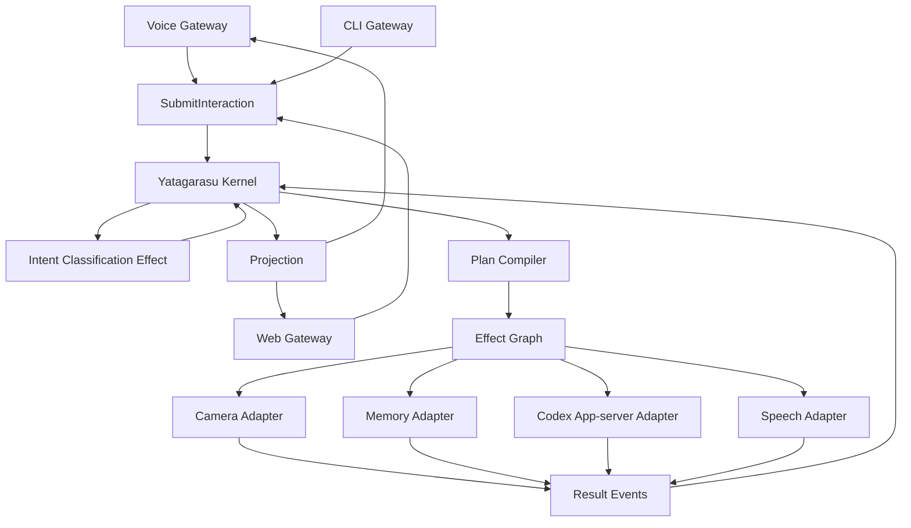

# Agent化要件のアーキテクチャレビュー

- 文書状態: Discussion Draft
- 作成日: 2026-07-31
- レビュー対象:
  - `00-architecture-vision.md`
  - `01-domain-and-execution-model.md`
  - `02-boundaries-and-runtime.md`
  - `03-evolution-plan-and-open-questions.md`
  - `04-agentization-requirements-draft.md`

## 1. 結論

Yatagarasu 2は、今回のAgent化要件を取り込む。

ただし、要件書に記載された`listend -> agent -> web`というプロセス所有関係は採用しない。
既存構想のState、Event、Rule、Transition、Effectを中核とし、Codex常駐、Web GUI、
モデル切替、Provider切替を、その世界モデルに追加する。

Yatagarasu 2の第一候補は次の構成とする。

```text
Rust
  Yatagarasu Kernel / Runtime / Gateway / Projection

Python
  WakeWord / SBERTなど、既存AI資産を利用するInference Adapter

Mimy STT Server
  go2rtcへ直接接続する独立STT Capability
```

これはRustとPythonへ責務を曖昧に分散する案ではない。
ドメイン判断はRust Coreへ集約し、PythonとMimyは型付き要求に対して推論結果を返す外部Adapterとする。

## 2. 今回の要件から採用する価値

次の要求はYatagarasu 2の正式な検討対象へ昇格させる。

- Codex app-serverを常駐させ、Turnごとの起動コストをなくす
- 音声、Web、CLIが同じInteraction処理系を利用する
- Web GUIで会話、状態、画像、Tool、レイテンシを可視化する
- SBERTでSkillだけでなくモデルプロファイルとProviderを選択する
- ローカルLLMとOpenAIを明示的に切り替える
- 同一Provider内のモデル切替では、可能な限りCodex Threadを維持する
- Provider切替失敗時にも音声入力とWebを生存させる
- 外部から登録するsystemd unitを原則一つにする
- TTFT、総応答時間、Effectごとの時間を因果関係付きで計測する

## 3. そのまま採用しない点

### 3.1 listendをSupervisorにしない

`listend`はAcoustic ContextのGatewayであり、AgentやWebの生存を所有しない。
音声障害時にもWebを継続する要件と、`listend`を親にする構造は両立しにくい。

単一unitが必要な場合は、`yatagarasud`がRuntime全体を起動する。
OS上で子プロセスが存在しても、その関係をドメイン上の上下関係にはしない。

### 3.2 Agentを巨大な司令塔にしない

`yatagarasu-agent`という名前のクラスへIntent判定、モデル選択、会話、Tool、復旧を集約しない。
それぞれのContextが重ならない状態を所有し、共通KernelがEventを順序付ける。

### 3.3 Unix socketをアーキテクチャの前提にしない

CommandとEventの契約を先に定義する。
同一processならchannel、別processならUnix domain socket、別machineなら別transportへ載せられる形にする。

初期配置でPython Inference Adapterを別processにする場合、Unix domain socketとJSONLは有力候補である。
Mimyは同一PCとLAN内別PCの両方へ配置するため、version付きHTTP APIを使用する。
ただし、transport固有の形式をDomain型へ漏らさない。

### 3.4 Codex Thread IDをプロダクトの会話IDにしない

Yatagarasuの`ConversationId`とCodexの`ThreadRef`を分離する。
Provider切替やCodex再起動でThreadが変わっても、Yatagarasu上の会話は継続できる。

### 3.5 モデル切替を一つの状態で表さない

次の二つを区別する。

- `PreferredModelProfile`: ユーザーが選択した通常の思考ギア
- `EffectiveModelRoute`: 現在のInteractionで実際に利用するモデル

例えばLOWが選択中でも、画像を含むInteractionだけVisionモデルへ一時Routeできる。
処理完了後はLOWへ戻り、ユーザーの選択を勝手に変更しない。

## 4. 更新後の論理構成



`yatagarasud`はKernel、Effect Dispatcher、Projection、Gatewayを収容できるが、
個別の業務判断を持つ巨大Serviceではない。

## 5. 拡張モデル

Rustでは、能力の境界をTraitとして定義する。

```rust
trait InboundGateway {}
trait IntentClassifier {}
trait PlanContributor {}
trait EffectHandler<E> {}
trait AgentRuntime {}
trait MemoryStore {}
trait ProjectionSink {}
```

ただし、Intentフレーズごとに新しいTraitを作らない。

新機能追加は、原則として次の組み合わせで表現する。

1. `IntentDefinition`または分類Strategyを登録する
2. IntentからEffect Graph断片を作る`PlanContributor`を追加する
3. 新しい外部能力が必要な場合だけ`Effect`型と`EffectHandler`を追加する
4. 状態表示が必要ならProjection reducerを追加する

既存KernelのMain loopへ条件分岐を追加しない。

### 5.1 SBERT Router

SBERTは一つの`IntentClassifier` Adapterである。

- 埋め込み計算とモデルロードはPython Adapterでよい
- Intent定義、閾値、Middle/High PolicyはRust側の設定と型で管理する
- Adapterは候補とscoreを返し、Effectを直接実行しない
- 複数Intentの合成と衝突処理はPlan Compilerが担当する

### 5.2 LLM Tool Call

Codexが返すTool Callは、即時実行命令ではない。
`EffectProposedByAgent` EventとしてKernelへ戻し、CapabilityとPolicyで検証してから実行する。

これにより、SBERT由来のEffectとLLM由来のEffectが同じ安全規則を通る。

## 6. モデルとProviderの状態

モデルルーティングでは、最低限次を管理する。

```text
ModelProfile
  provider
  model
  capabilities
  privacy_class
  tool_support
  context_limit

RoutingState
  preferred_profile
  effective_route
  provider_state
  model_residency
```

Provider変更は、`SwitchProvider` Effectとして表す。
Codex Adapterがapp-server再起動を必要とする場合、その実装詳細はAdapter内部へ閉じ込める。

状態遷移例:

```text
Ready
  -> ProviderSwitchRequested
  -> DrainingActiveTurn
  -> RuntimeRestarting
  -> RuntimeInitializing
  -> ConversationRebinding
  -> Ready
```

失敗時は旧Providerへの復旧、縮退、明示的失敗のいずれかをPolicyが選択する。

## 7. 会話と記憶

Codex Threadの常駐化により、既存SemanticMemoryとの二重注入が起きる可能性がある。
役割を次のように分ける。

- Codex Thread: 現在進行中の短期会話
- Conversation Context: Yatagarasuが所有する正規化されたTurn履歴
- SemanticMemory: 長期記憶の検索Adapter
- Event Journal: 実行事実と障害解析

Yatagarasuの会話をCodex Threadだけへ委ねない。
Thread再生成時に必要なContextを再構築できることを要件とする。

## 8. Web GUI

WebはCoreを操作する別オーケストレーターではない。
Commandを投入し、Projectionを購読するGatewayである。

初期機能:

- Chat入力と回答stream
- 音声認識結果
- InteractionとEffectの進行状態
- 現在のPreferred／Effectiveモデル
- Provider状態
- カメラ画像
- エラーとレイテンシ
- Interaction取消

Windows端末から利用する場合、`localhost` bindでは到達できない。
LAN公開を正式対応する段階で、認証、TLSまたは信頼済みReverse Proxy、接続元制限を要件化する。

## 9. 言語方針

### 9.1 Rustを選ぶ理由

- enumでCommand、Event、Effect、Failureを閉じた型として表現できる
- ownershipでStateの単一Writerを守りやすい
- TraitでPortとAdapterを追加できる
- async runtimeがCodex stdio、WebSocket、Timer、Effect並行実行に適する
- 常駐Daemonとしてメモリ、取消、終了処理を管理しやすい

### 9.2 Pythonを残す理由

- Sentence Transformersの既存資産を再利用できる
- WakeWord最適化済み実装を段階的に移植できる
- モデル変更や実験を高速に行える
- ReazonSpeech K2は独立したMimy STT Server内で再利用する

### 9.3 境界

Python WorkerとMimyは、入力またはSession Commandを受けて推論結果を返す。
WorldState、Plan、Provider状態、会話状態を所有しない。

最初の技術検証で次を測る。

- RustからCodex app-serverを常駐制御できるか
- RustとPython間IPCの往復時間
- MimyのListen Session APIとLAN配置時のEnd-to-End遅延
- SBERTの起動、常駐メモリ、推論時間
- Python Worker異常終了時の復旧
- 配布とsystemd起動の複雑さ

## 10. 改訂した実装順

1. RustでDomain型、Rule、Transition、Effect GraphをFake Adapterだけで実装する
2. RustからCodex app-serverを常駐制御する技術検証を行う
3. Python SBERT WorkerとのIPCを検証する
4. CLIからText Interactionを通し、会話とモデル切替を実現する
5. Tapo CameraのMoveとCaptureをEffect Adapterとして接続する
6. Web ProjectionとChat Gatewayを追加する
7. Voice Gatewayを移植し、Mimy Listen Sessionと接続する
8. SemanticMemoryと再起動復旧を追加する
9. Provider切替と会話再束縛を追加する

Yatagarasu 1はこの間も安定運用を続ける。
C210をYatagarasu 2の実機検証機とし、TC70の現行環境へ未完成コードを混入させない。

## 11. 次に決めること

1. Rust/Python境界のIPC形式とWorker管理方式
2. `PreferredModelProfile`から`EffectiveModelRoute`を選ぶPolicy
3. Vision要求時の一時Routeを自動で許可する範囲
4. Provider切替時の実行中Turnを完了、取消、待機のどれにするか
5. 会話履歴、Codex Thread、SemanticMemoryへ保存する情報の境界
6. Event JournalをMVPから導入するか
7. WebのLAN公開と認証をどのMilestoneへ含めるか

## 12. 判定

既存のYatagarasu 2構想は、今回のAgent化要件によって否定されない。
むしろ、常駐Agentという具体的な実行要求を得たことで、State・Event・Effectの抽象モデルを
実用システムへ接続する条件が明確になった。

必要なのは「Agentを中心に置く」ことではない。
Codex、SBERT、音声、Web、カメラが同じ法則で参加できるKernelを中心に置くことである。
